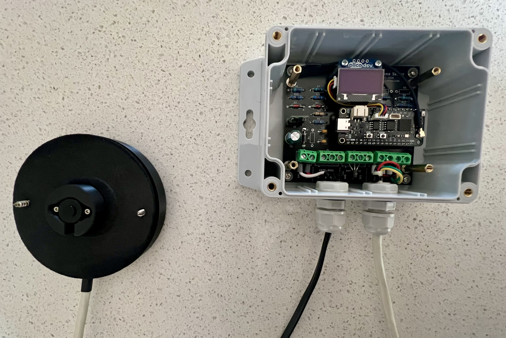

# ESPHome Sensor

An ESP32-S3 based sensor board system for ESPHome and Home Assistant, designed for outdoor environmental monitoring with a focus on hot water system and water tank level monitoring. Includes a complete mechanical system with 3D printable parts and a purpose-built outdoor 12V DC power distribution unit.



*Tank Sensor with Adapter*

## Features

- ESP32-S3 (FeatherS3D) with WiFi and ESPHome integration
- PiicoDev OLED display for local status indication
- Dual 1-Wire buses for DS18B20 temperature sensors
- I2C expansion for ToF distance sensors (DFRobot SEN0590)
- RGB LED status indicator with gradient colour coding
- Outdoor-rated polycarbonate enclosures with cable glands
- Purpose-built 12V DC zone power distribution unit (PSU backboard)
- 3D printed PETG-HF mechanical components

## Main Hardware Overview

| Component | Description |
|-----------|-------------|
| ESP32-S3 FeatherS3D | Main microcontroller |
| PiicoDev OLED 128x64 | Local display |
| Pololu D24V5F5 | 5V step-down regulator |
| DFRobot SEN0590 | ToF distance sensor |
| DS18B20 | 1-Wire temperature sensors |
| Mean Well IRM-30-12ST | 12V 2.5A AC/DC PSU |

## Documentation

- [Hardware](docs/hardware.md) — PCB design, schematic, BOM, KiCad files
- [Mechanical](docs/mechanical.md) — 3D printing, enclosures, print settings, materials
- [PSU Backboard](docs/esphome-sensor-psu-backboard.md) — Outdoor 12V DC power distribution unit

## Project Structure

```
├── README.md
├── hardware/
│   └── kicad/              # KiCad schematic, PCB, Gerber, BOM
├── mechanical/
│   ├── fusion360/          # Fusion 360 source files (.f3d)
│   ├── exports/            # STL and STEP files for printing
│   └── icons/              # Incons used in the covers
├── datasheets/             # Component datasheets
└── docs/                   # Detailed documentation
    └── images/             # Build photos
```

## Applications

- Heat pump hot water system monitoring (temperature, capacity estimation)
- Rainwater tank level monitoring (ToF distance sensor)
- Outdoor distributed IoT sensor power distribution

## TODO

- [ ] Write `docs/hardware.md`
- [ ] Write `docs/mechanical.md`
- [ ] Better tank sensor demo photo
- [ ] Sync software for ESPHome in personal HA repo here
- [ ] UV rated cables for ToF sensor
- [ ] Finalise tank adaptr
  - [ ] Proper cable mounts
  - [ ] Brass inserts
  - [ ] Exit hole size increase
- [ ] Inprove 3D printed covers in PETG-HF
- [ ] Light pipes on the tank sensor

## License

MIT License — Copyright (c) 2026 Greg Robinson
