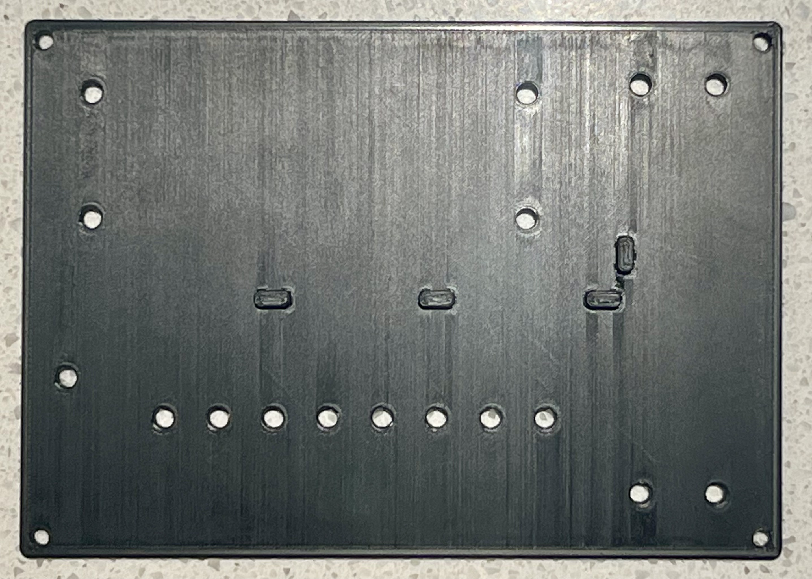
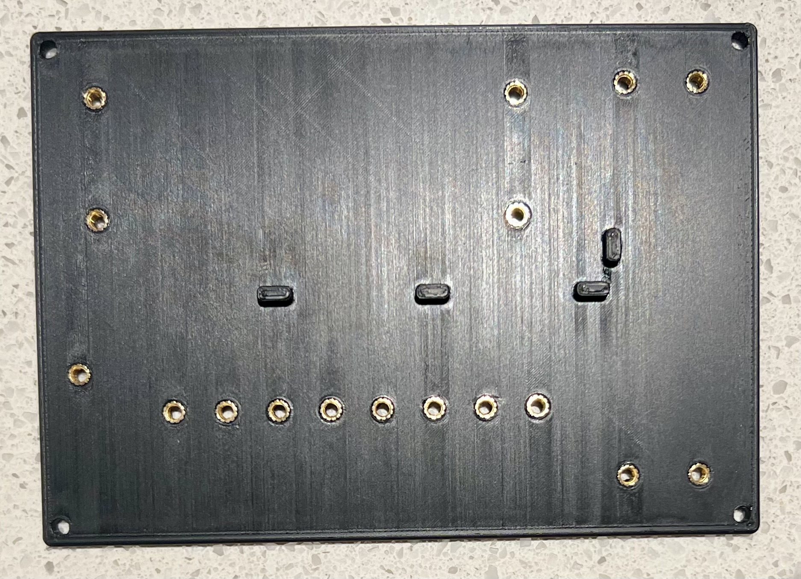
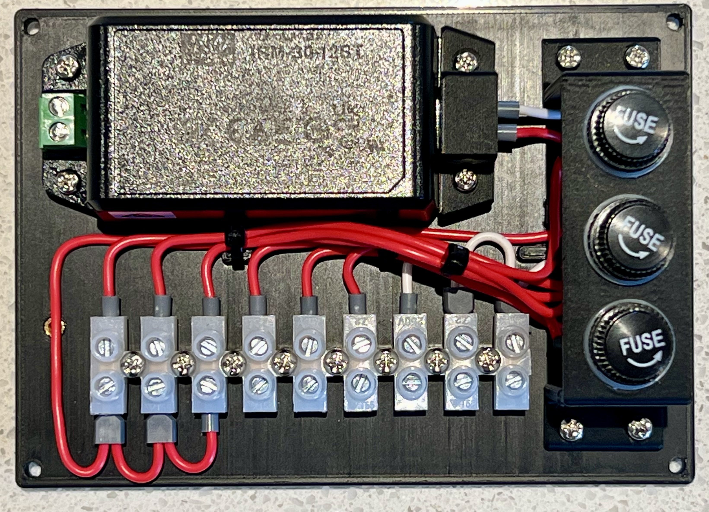
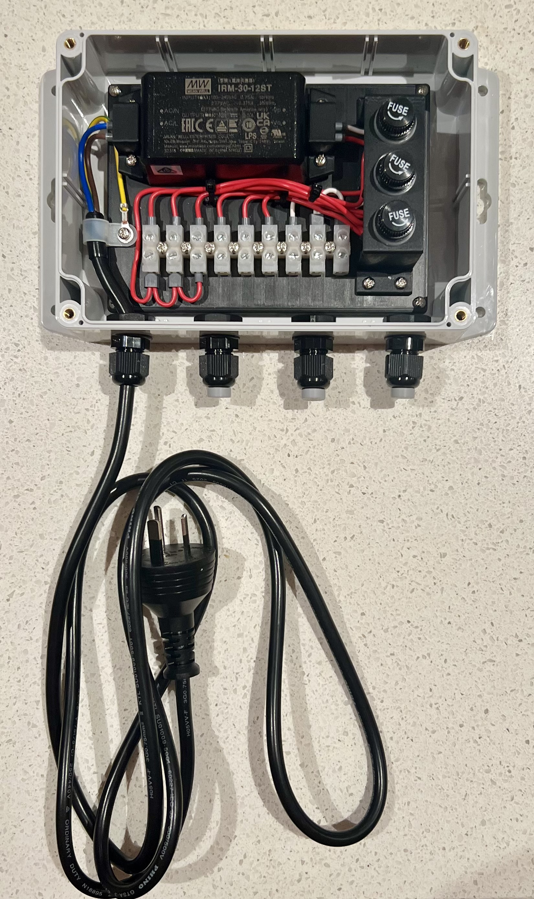

# ESPHome Sensor PSU Backboard

## Overview
The PSU backboard is a 3D printed mounting and protection component for the power supply unit of the ESPHome sensor boards. It provides structural support, cable management, and safety isolation for the power electronics. The board houses a 12V DC supply fed from 240V AC, with three independently fused DC outputs feeding external ESP32 sensor modules.

## Design Decisions

### Structural Design
- **Material**: PETG-HF — chosen for outdoor use, mechanical strength, and compatibility with heat inserts
- **Thickness**: 4.5mm to fully retain 4mm long heat inserts with 0.5mm clearance below
- **Wall Loops**: 4 for mechanical strength around heat insert bosses
- **Cable Management**: Integrated cable tie anchor points and cable routing channels on top surface
- **Fixings**: M3 brass heat inserts, 3.9mm hole diameter, 4.5mm deep, 0.3mm entry chamfer
- **Fillets**: 2mm on main board edges, 1mm on all other features

### Layout
- PSU mounted left-to-right, AC terminals facing left wall (short AC run)
- All cable glands on bottom wall — AC left, DC right (water ingress protection)
- 6-way terminal block centre-right: 3x GND direct out, 3x DC+ through inline fuses
- Fuse holders between terminal block and DC cable glands
- AC and DC sides physically separated across the plate

### Safety Considerations
- **AC Isolation**: Printed cover over PSU AC terminals to prevent accidental contact
- **Fusing**: 250mA fast-blow fuse on each DC output circuit (one per ESP32 module)
- **Ventilation**: Not required — low dissipation at 250mA fused output
- **Fuse Access**: Accessible inline fuse holder mounting for easy maintenance

## Print Settings

### Material
- Bambu Labs PETG-HF
- Print temperature: 235-240°C nozzle, 70-75°C bed (240°C initial layer, 235°C other layers)
- Calibrated flow rate defaults on Bambu Labs P2S

### Print Orientation
- **Recommended Orientation**: Backboard flat on bed, cable clips and bosses printing upward
- **Support Material**: None
- **Build Plate Adhesion**: None required — ensure bed is clean (IPA wipe) before printing

### Quality Settings
- **Walls**: 4
- **Top/Bottom Layers**: 5
- **Ironing**: Top surfaces only
- **Ironing Speed**: 15mm/s
- **Ironing Flow**: 20%
- **Ironing Line Spacing**: 0.08mm
- **Ironing Pattern**: Rectilinear

## Heat Insert Installation

- **Insert spec**: M3 x L4 x OD4.2mm (top) / OD3.75mm (bottom)
- **Hole size**: 3.9mm diameter, 4.5mm deep
- **Entry chamfer**: 0.3mm (edge break only — do not chamfer deeply or insert will tilt)
- **Technique**: Let insert sit level in hole before applying iron. Soldering iron weight provides gentle downward pressure, allow heat to do the work over 5-10 seconds. Let cool fully before applying load.
- **Note**: 3.85mm hole confirmed too tight. 3.9mm confirmed correct for this insert with unironed surfaces. Ironed surfaces may require 4.0mm or post-print clearing with 4mm drill bit.

## Assembly Notes

### Required Hardware
| Item | Source |
|------|--------|
| Bambu Lab PETG-HF (Black) | [Bambu Lab](https://au.store.bambulab.com/products/petg-hf) |
| M3 Threaded Inserts M3xL4xOD4.2 | [Amazon AU](https://www.amazon.com.au/dp/B0BBSLL6G7) |
| Meanwell IRM-30-12ST 30W 12V 2.5A PSU | [Jaycar MP3302](https://www.jaycar.com.au/30w-12v-2-5a-mini-power-supply/p/MP3302) |
| 250VAC 10A M205 Inline Fuse Holder | [Jaycar SZ2030](https://www.jaycar.com.au/250vac-10a-m205-panel-mount-fuse-holder/p/SZ2030) |
| 250mA M205 Fast-Blow Fuse 250VAC | [Jaycar SF2154](https://www.jaycar.com.au/250ma-m205-quick-blow-fuse-250vac/p/SF2154) |
| 6 Amp 12-way Screw Terminal Strip (6 positions used) | [Jaycar HM3194](https://www.jaycar.com.au/6-amp-12-way-screw-terminal-strip/p/HM3194) |
| Polycarbonate Enclosure 171 x 121 x 80mm | [Jaycar HB6221](https://www.jaycar.com.au/polycarbonate-enclosure-with-flange-171-x-121-x-80mm/p/HB6221) |
| 3-6.5mm DIA Waterproof Cable Glands | [Jaycar HP0720](https://www.jaycar.com.au/3-6-5mm-dia-waterproof-cable-glands-pack-of-2/p/HP0720) |
| 7.5A 2-core cable (12V input wiring) | [Jaycar WH3057](https://www.jaycar.com.au/7-5a-2-core-tinned-dc-power-cable-red-white/p/WH3057)|
| Ferrule crimps (matched to wire gauge) | [Amazon AU](https://www.amazon.com.au/dp/B0BZPPLP5W)|

### Wiring Notes
- All cable glands on bottom wall for water ingress protection
- DC outputs: 250mA fast-blow fuse per output circuit (3 total)
- Terminal block positions: +in(F1) | +in(F2) | +in(F3) | +out(F1) | +out(F2) | +out(F3) | GND | GND | GND
- Ferrule crimps on all wire ends
- 12V input wired with 7.5A 2-core cable (oversized — lowest available gauge)

### Assembly Sequence
1. Install heat inserts at 250-260°C (250°C worked for me)
2. Mount PSU to backboard with M3 screws through AC terminal cover/bracket
3. Mount terminal block and fuse holders
4. Wire AC side: cable gland → inline fuse → PSU L and N terminals
5. Wire DC side: PSU +/− → terminal block → fuses → DC cable glands
6. Install backboard into enclosure
7. Install cable glands and route cables

## Images

*3D printed PSU backboard showing heat insert bosses and cable management features*

*Heat inserts installed*

*Backboard mounted in enclosure with PSU, terminal block, and fuse holders*

*Complete assembly ready for deployment*

## Version History
| Version | Notes |
|---------|-------|
| v1 | Initial test print — ironing settings tuned, insert hole confirmed |

## Design Files
- **Source**: `mechanical\fusion360\esphome-sensor-psu-backboard.f3d` (Fusion 360)
- **Backboard Export**: `mechanical\exports\esphome-sensor-psu-backboard[-vx].stl`
- **PSU Terminal Cover/Bracket**: `mechanical\exports\esphome-sensor-psu-terminal-cover[-vx].stl`
- **Fuse Holder Mount**: `mechanical\exports\esphome-sensor-psu-fuse-holder[-vx].stl`
